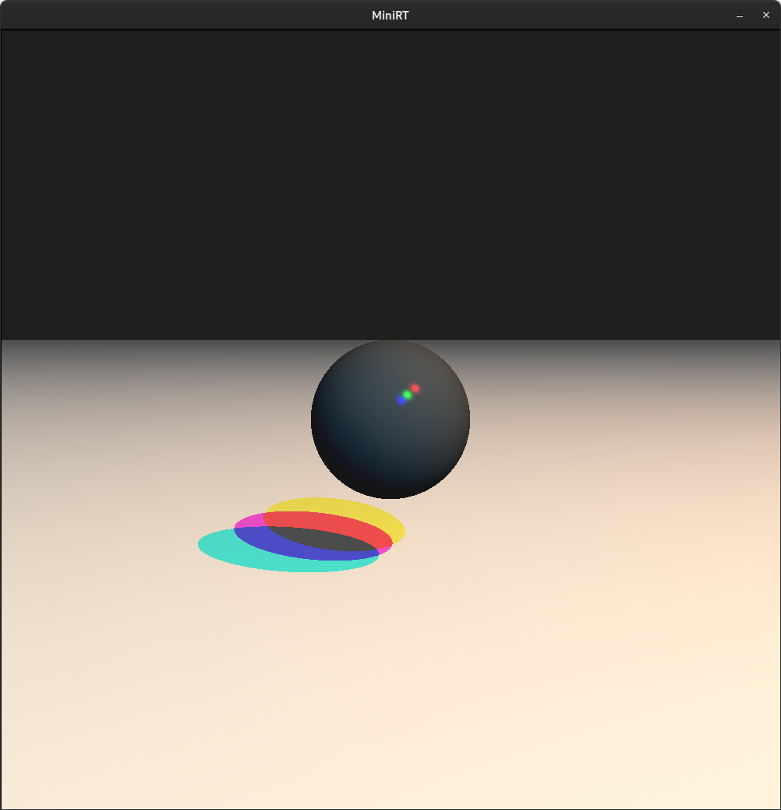
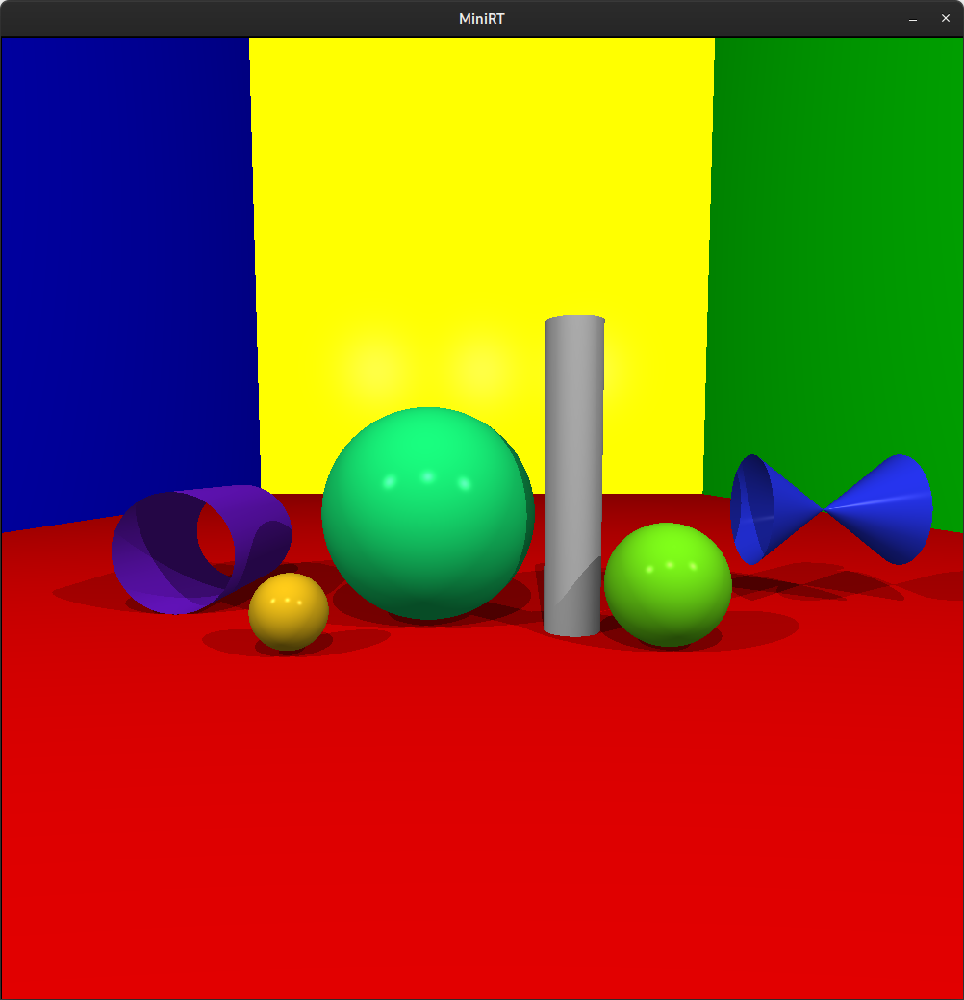

# miniRT

An introduction to raytracing.

## Table of Contents
- [About](#about)
- [Installation](#installation)
- [Usage on linux](#usage-on-linux)
- [Usage on macOS](#usage-on-macos)
- [Sample images](#sample-images)
- [Sources](#sources)

## About

This program was developed together with [Tiziano](https://github.com/tiziaco). It allows you to render simple computer-generated images using a ray tracing algorithm. It is developed in C and utilizes the miniLibX, a simple X-Window (X11R6) programming API.

## Installation
Install miniLibX dependencies:
```
sudo apt-get install -y libxext-dev libxrandr-dev libx11-dev libbsd-dev libssl-dev
```

Clone this repo:
```
git clone https://github.com/deniz-oezdemir/miniRT
cd miniRT
```

Compile the program:
```
make
```

This will generate the miniRT executable in the project directory.

## Usage on linux
To render a scene, execute the program with a valid .rt scene file as an argument:
```
./miniRT <scene-file.rt>
```

## Usage on macOS
Instructions for macOS will be added by [Tiziano](https://github.com/tiziaco).

## Sample images
An image close to my current GitHub profile picture:



An image showcasing all the shapes that can be generated by this program:



## Sources
- Buck, J. (2019). The Ray Tracer Challenge: A test-driven guide to your first 3D renderer. The Pragmatic Bookshelf.
