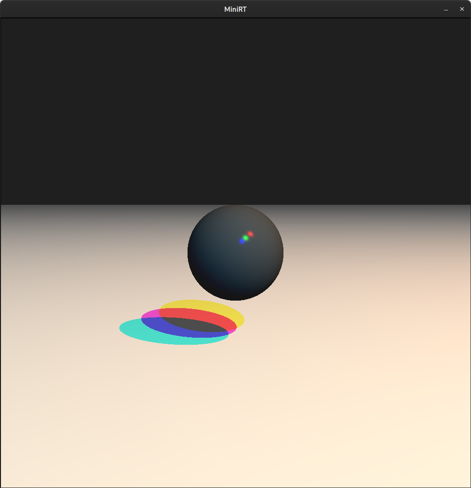
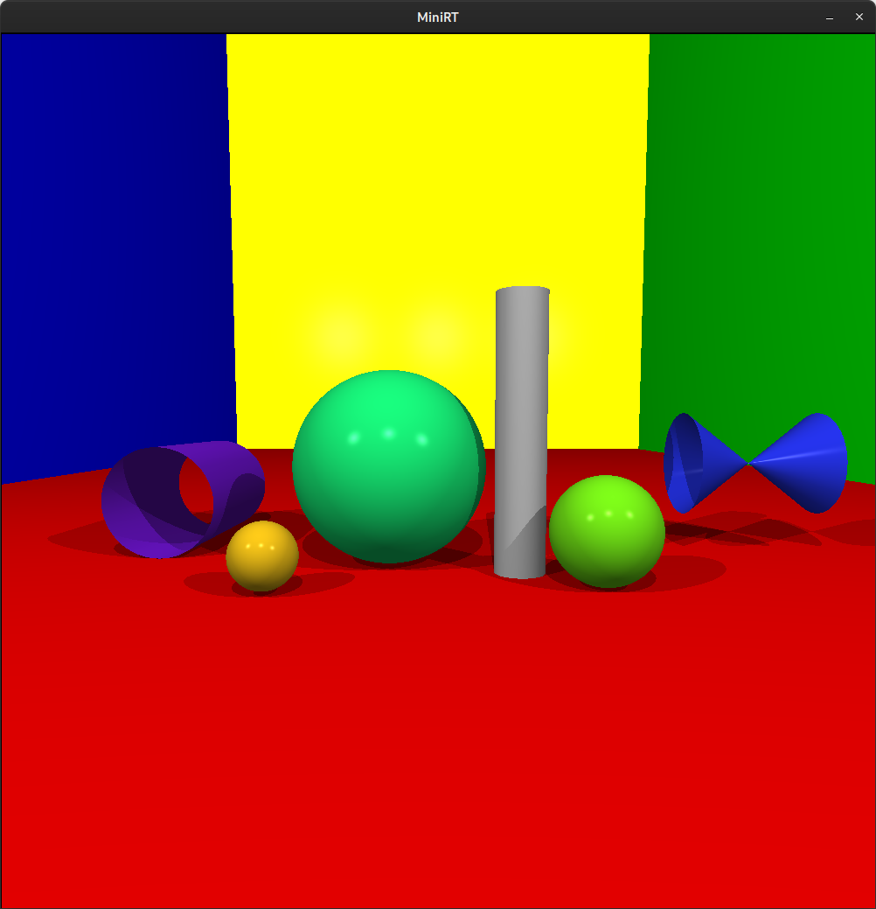

# miniRT

An introduction to raytracing.

## Table of Contents
- [About](#about)
- [Installation](#installation)
- [Usage](#usage)
- [Sample images](#sample-images)
- [Sources](#sources)

## About

This program was developed together with [Tiziano](https://github.com/tiziaco). It allows you to render simple computer-generated images using a ray tracing algorithm. It is developed in C and utilizes the miniLibX, a simple X-Window (X11R6) programming API.

Regarding the development process, we initially followed the Test-Driven Development (TDD) approach from *The Ray Tracer Challenge* (Buck, 2019). This helped us understand ray tracing and allowed us to quickly verify our implementations. However, as we neared the end of the project and aimed to meet the specific [subject requirements](./en.subject.pdf), we found that TDD was slowing us down. Consequently, we decided to stop using TDD, and the tests are now deprecated.

## Installation
Install miniLibX dependencies:
```
sudo apt-get install -y libxext-dev libxrandr-dev libx11-dev libbsd-dev libssl-dev
```

Clone this repo:
```
git clone https://github.com/deniz-oezdemir/miniRT
cd miniRT
```

Compile the program:
```
make
```

This will generate the miniRT executable in the project directory.

## Usage
To render a scene, execute the program with a valid .rt scene file as an argument:
```
./miniRT scene/<scene-file.rt>
```

## Sample images
An image close to my current GitHub profile picture:



An image showcasing all the shapes that can be generated by this program:



## Sources
- Buck, J. (2019). The Ray Tracer Challenge: A test-driven guide to your first 3D renderer. The Pragmatic Bookshelf.
